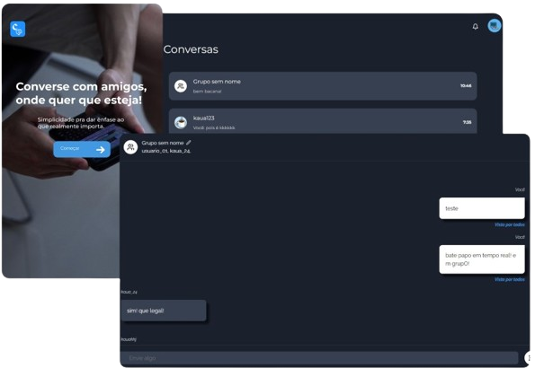

<div align="center" style="display: flex; flex-direction: column; align-items: center;"> 
  
  <div style="display: flex; flex-direction: column">
  <h1 style="margin-bottom: 0;">
  Chathub
  </h1>
  <p>
    Your chat application
  </p>
  </div>
</div>

<h1 align="center">

</h1>

## 📘 About

**Chathub** is a real time chat application. My goal with this project was to learn and practice a few techlogies, like Socket.IO (both in the front-end and back-end), NestJS (for the API)

## 🔨 Tools

- [Socket.IO](https://socket.io)
- [NodeJS](https://nodejs.org/en)
- [NestJS](https://nestjs.com/)
- [React](https://react.dev/)
- [Sequelize](https://sequelize.org/)
- [MariaDB](https://mariadb.org/)

## 🚀 Quick Start

```bash
    # Clone the project
    $ git clone https://github.com/Kaua2123/chathub-client.git
```
```bash
    # Enter directory
    $ cd chathub-client
```

```bash
    # Install the dependencies, if use npm
    $ npm install
```

```bash
    # Install the dependencies, if use yarn
    $ yarn
```